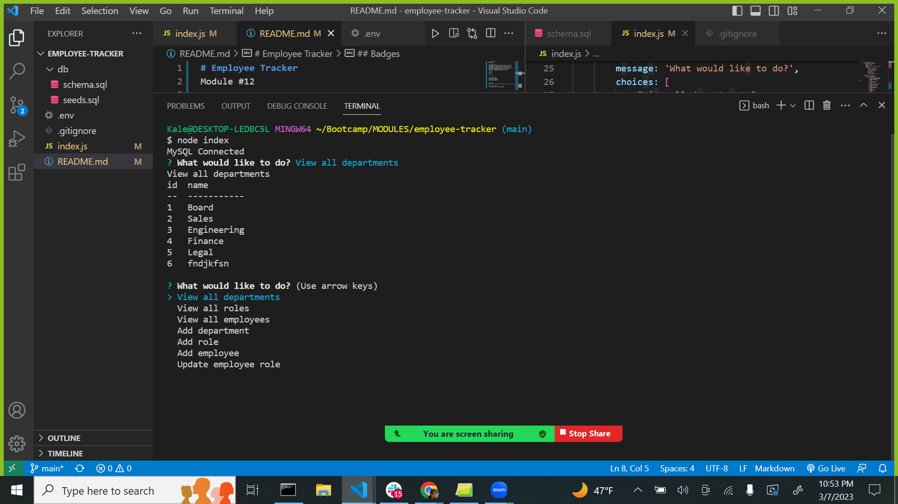

# Employee Tracker
Module #12

## Description
The employee tracker allows the user to look for employees' full names, roles and titles, salaries, and manager. It also allows the user to view existing departments and roles. If needed, the user can add a new department, add a new role or employee, or update an employee's role. 

## Badges
None

## Visuals

## Installation
npm install dotenv
npm install inquirer
npm install mysql2

## License
None

## Project status
Error number 1452 on Add Employee.

